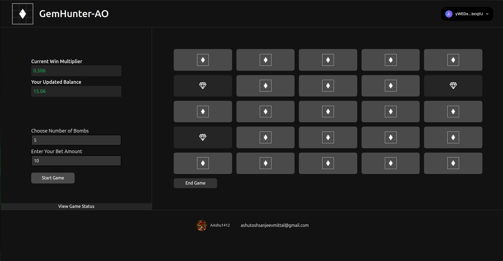
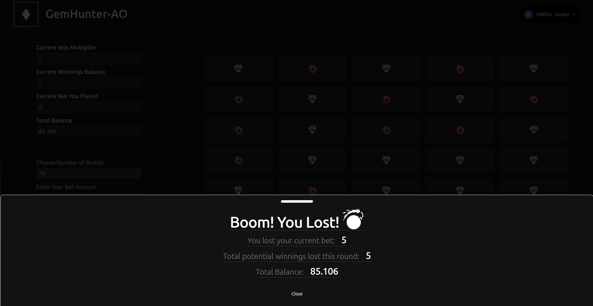

<div align="center">


# GemHunter-AO

</div>

<p align="center">
  
</p>
<p align="center">
  
</p>

<p align="center">
  GemHunter-AO is an engaging, grid-based gambling game built with Lua and lsqlite3, designed for players to test their luck and strategy. 

  In this game:
  - Players stake an amount and select the number of bombs hidden on a 5x5 grid of closed tiles. The more bombs selected, the higher the potential reward. 
  - Players open tiles to discover diamonds, which increase their earnings. Each time a player uncovers a diamond, their earnings increase, bringing them closer to a higher payout.
  - However, a wrong choice of bomb results in the loss of their stake.
  - Players can end the game at any time to secure their winnings. 

  **Winning**:  
  If players successfully open all the tiles containing diamonds and avoid the bombs, their earnings are further boosted by a **5x multiplier**, providing a significant reward.

  The game tracks player progress using an lsqlite3 database, ensuring that players can resume from where they left off, even after exiting.
</p>


## [Live Demo](https://gem-hunter-ao.vercel.app/)


# Index

- [GemHunter-AO](#gemhunter-ao)
- [Live Demo](#live-demo)
- [Index](#index)
- [Introduction](#introduction)
  - [Techstack](#techstack)
  - [Key Features](#key-features)
  - [How It Works](#how-it-works)
- [How to setup](#how-to-setup)
  - [Clone the repo](#clone-the-repo)
  - [Install dependencies](#install-dependencies)
  - [ArConnect Wallet](#arconnect-wallet)
- [Finally run the webapp](#finally-run-the-webapp)
- [License](#license)

# Introduction

Welcome to **GemHunter-AO**, a thrilling grid-based gambling game where strategy, luck, and timing determine your rewards. In this game, players can choose a grid filled with hidden mines, each holding the potential for significant wins or losses. Your goal is to uncover diamonds and increase your earnings by selecting tiles on a 5x5 grid without hitting a bomb.

The more bombs you choose, the higher the potential reward, and for every diamond you uncover, your earnings increase by `0.002` times.

If you're able to successfully avoid the bombs and uncover all the diamonds, your winnings are further amplified by a `5x` multiplier, rewarding your skill and strategy. Players can stop the game at any point to cash out, and their game data is securely stored in a **Lua lsqlite3** database, ensuring that they can continue from where they left off, even if they leave mid-game.

**Developed for the Hacker House event by Arweave India**, GemHunter-AO combines excitement with innovation, providing a captivating and rewarding gaming experience.

**[Try it out here!](https://gem-hunter-ao.vercel.app/)**

## Techstack
     
    - Vite + ReactJS with Javascript
    - TailwindCSS
    - LUA (lsqlite3)
    - AO Connect
    - Arweave-wallet-kit
    - Shadcn

## Key Features

### 🎮 **Dynamic Grid Gameplay**
- Players choose from a 5x5 grid of closed tiles, with each tile containing either a **bomb** or a **diamond**. The goal is to open tiles without hitting a bomb to increase your earnings.

### 💰 **Stake and Reward System**
- Players stake an amount before the game begins. The potential reward increases based on the number of bombs selected.
- The reward formula takes into account both the number of bombs and the number of successful tile openings.

### 💾 **Real-Time Data Storage**
- All player progress is saved using a **Lua lsqlite3** database, enabling seamless game continuation, even if the player exits mid-session.

### ⚙️ **Customizable Difficulty**
- Players can choose the number of bombs they want on the grid. The more bombs chosen, the greater the potential reward.

### 🚀 **Game Progression and Win Mechanism**
- Every tile opened increases the reward by a fixed amount (**0.002**).
- Discovering diamonds helps players accumulate more winnings. 
- **Win Bonus**: If players successfully open all the tiles containing diamonds without hitting a bomb, their earnings are boosted by a **5x multiplier**. Players can choose to cash out anytime to secure their winnings.

### 🔄 **Game Continuation Feature**
- Players can leave the game and return later to continue from where they left off, with all previous game data preserved.

### ✋ **Flexible Exit Option**
- Players can choose to end the game at any time, ensuring they don’t lose their stake unexpectedly.

### 📊 **Tracking and Review**
- Players can review their current match details and past game history within the app, making the game experience more engaging and rewarding.


## How It Works

1. **Stake your bet**: Choose your bet amount and select how many bombs you want to hide in the grid.
2. **Open tiles**: Start opening tiles. For every diamond found, your earnings increase.
3. **Avoid bombs**: Be careful—hitting a bomb means losing your stake. If you choose to stop before opening a bomb, you can cash out with your accumulated earnings.
4. **Winning**: Successfully open all the diamond tiles without hitting a bomb, and enjoy a 5x multiplier bonus on your winnings.
5. **Seamless Continuation**: All progress is saved in real-time, so you can pick up where you left off whenever you return.


# How to setup
## Clone the repo

Fork and clone the repo

```bash
git clone git@github.com:AAshu1412/GemHunter-AO.git
cd GemHunter-AO
```

## Install dependencies

```bash
npm install
```
## ArConnect Wallet
If you don't have ArConnect Wallet then [click here](https://www.arconnect.io/download) to download the wallet on your browser.

After downloading the wallet setup your wallet to use the AO_DATABASE

# Finally run the webapp

```bash
npm run dev
```

The webapp will be running on `localhost:5173`

To open the same application of another device for testing purposes, make sure that the device is connected to the same network as the device on which the webapp is running. Then visit `http://<IP_ADDRESS_OF_THE_DEVICE_RUNNING_THE_WEBAPP>:5173`

# License

The projects is licensed under [MIT](https://choosealicense.com/licenses/mit/)
